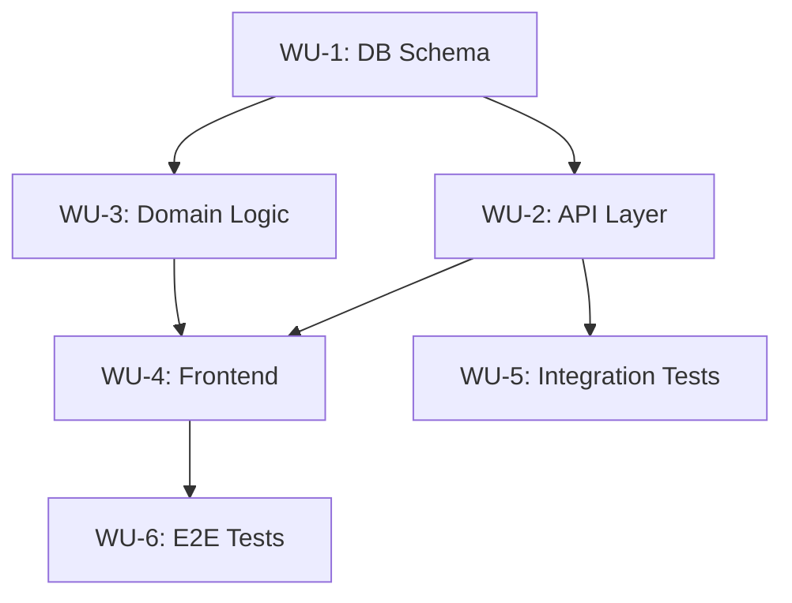

# Blueprint — 大規模プロジェクト設計図

## 概要

1行の目的から、複数セッション・複数PRにまたがる実装計画を自動生成する。
各ステップは「cold-start brief」を持ち、前のセッションのコンテキストなしで実行可能。

## トリガー

- 「大規模な実装計画を立てて」
- 「複数PRに分割して計画して」
- 「blueprintを作って」
- `/blueprint <目的>`
- 明らかに複数セッションが必要な大規模タスク

## プロセス

### Phase 1: 目的の分解

1. ユーザーの1行目的を受け取る
2. `exploring-codebase`で現状のアーキテクチャを把握
3. `learnings-researcher`で過去の類似プロジェクトを検索
4. 目的を**独立した作業単位（Work Unit）**に分解

### Phase 2: 依存グラフ構築

各Work Unitの依存関係を分析し、DAG（有向非巡回グラフ）を構築:

```markdown
## Dependency Graph


```

### Phase 3: Cold-Start Brief生成

各Work Unitに以下を含む自己完結的briefを生成:

```markdown
## WU-N: [タイトル]

### Cold-Start Brief
> このセッションで必要な全コンテキスト。前のセッションを読む必要なし。

**目的**: [このWUが達成すること]
**前提**: [依存WUの成果物と場所]
**変更対象**: [ファイルパスのリスト]
**完了条件**: [具体的な検証基準]
**推定規模**: [S/M/L]

### タスク
1. [ ] ...
2. [ ] ...

### Anti-Patterns（やってはいけないこと）
- ...
```

### Phase 4: Adversarial Review Gate

`context/workflow-rules.md`の**レビューアー選択ガイド**に従い、Tier 1コア（`arch-reviewer`, `security-reviewer`, `perf-reviewer`）を並列起動 + `implementation-planner`で実装順序・並列化の最適性を検証。

レビュー指摘を反映して計画を修正。指摘が残る場合は追加ラウンド。

### Phase 5: 出力

`${MEMORY_DIR}/memory/YYMMDD_<task>/blueprint.md` に保存:

```markdown
# Blueprint: [プロジェクト名]

## Overview
[1段落の概要]

## Dependency Graph
[Mermaid図]

## Work Units
### WU-1: [タイトル]
[Cold-Start Brief]
...

## Parallel Execution Opportunities
[並列実行可能なWUの組み合わせ]

## Risk Register
[リスクと緩和策]

## Estimated Total
- Work Units: N
- Estimated Sessions: N
- Critical Path: WU-X → WU-Y → WU-Z
```

## Workflowとの関係

**Blueprintは Phase 0-5.5 の「上位レイヤー」として機能する。置き換えではない。**

```
/blueprint → blueprint.md（WU分割 + 依存DAG）
  └─ WU-1 → セッション1: Phase 0（Cold-Start Brief読込）→ 1 → 2 → 3 → 4 → 5
  └─ WU-2 → セッション2: Phase 0（Cold-Start Brief読込）→ 1 → 2 → 3 → 4 → 5
  └─ WU-N → セッションN: Phase 0 → ... → 5 → 5.5
```

- **Blueprint Phase 1（目的の分解）** ≠ **Workflow Phase 1（詳細調査）**: Blueprintはマクロ分割のみ。各WU実行時のPhase 1は省略不可
- **Blueprint Phase 4（Adversarial Review）** → `workflow-rules.md`のレビューアー選択ガイドに従う
- **Cold-Start Brief** → Phase 0の「コンテキスト復元」で読み込まれる

## 大規模タスクへの対応 (large-task merged)

blueprint は単発の大規模タスク（多セッション分割が必要なもの）にも対応する:
- WU=1 でも cold-start brief 形式で生成可能
- セッション分割 + タスクテンプレートは Cold-Start Brief で代替
- 「複数セッションかかる単発実装」はそのまま blueprint を使う（旧 large-task の役割）
