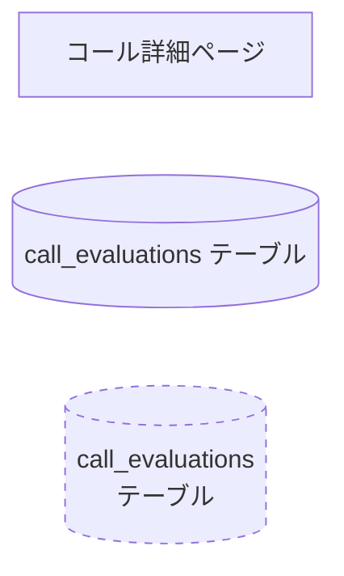

# Mermaid 構文の注意事項

`generate-state-diagram` SKILL.md から参照される Mermaid 構文ルール集。

## ルール1: state名は英語IDで定義し、ラベルで日本語を表示する

```mermaid
%% ✅ 正しい
state "トリガー" as trigger
note right of trigger
    説明テキスト
end note

%% ❌ NG: 日本語state名をそのままnoteターゲットに使う → サイクルエラー
state トリガー {
    note right of トリガー
        説明テキスト
    end note
}
```

## ルール2: stateブロック内でそのstate自身の名前をnoteターゲットにしない

```mermaid
%% ✅ 正しい: ブロック外でnote
state "評価基準取得" as criteria_fetch {
    [*] --> dept_search
}
note right of criteria_fetch
    説明テキスト
end note

%% ✅ 正しい: ブロック内の子stateにnote
state "評価基準取得" as criteria_fetch {
    state "部署基準検索" as dept_search
    note right of dept_search
        子stateへの説明
    end note
}

%% ❌ NG: ブロック内で親stateと同名のターゲット → サイクルエラー
state 基準取得 {
    note right of 基準取得
        説明テキスト
    end note
}
```

## ルール3: flowchartではノードIDに日本語を使わず角括弧内に記載する



## ルール4: classDiagram / erDiagramでは関連の方向とカーディナリティを明示する

```mermaid
%% ✅ 正しい: classDiagram でドメインモデル
classDiagram
    class Invoice {
        +String id
        +Date issueDate
        +InvoiceStatus status
    }
    class Journal {
        +String id
        +Amount debit
        +Amount credit
    }
    Invoice "1" --> "*" Journal : 仕訳を持つ

%% ✅ 正しい: erDiagram でテーブル関連
erDiagram
    INVOICES ||--o{ JOURNALS : has
    JOURNALS }o--|| ACCOUNT_ITEMS : references
```

## 頻出エラーと修正パターン（経験則）

| エラーパターン | 原因 | 修正 |
|--------------|------|------|
| `NodeID[/label]` がパースエラー | `[/text/]` は parallelogram 形状指定。スラッシュ片方だけだと不正 | `NodeID["/label"]` |
| `NodeID[label<br/>line2]` がレンダリング崩れ | `<br/>` を含むラベルは引用符必須 | `NodeID["label<br/>line2"]` |
| `A -.Phase 1.5.-> B` がパースエラー | 矢印ラベル中のドット `.` が終端マーカー `.->` と衝突 | `A -. "Phase 1.5" .-> B` |
| stateDiagram で `state foo` と `state "Foo Label" as foo` が両方ある | 同一 state の二重定義 | 後者のみ残す |
| `<task>` がレンダリングされない | HTML タグとして解釈される | `&lt;task&gt;` または `[task]` のような別表記 |
| `A & B & C --> D` がパースエラー | `&` 演算子は mermaid v9.4+ のみ | `A --> D` `B --> D` `C --> D` に展開 |
| classDiagram で `+String id` が消える | 引数なし型のフィールド | `+String id` のままで OK、表示崩れは renderer 依存 |
| flowchart で日本語ノード ID | 日本語は引用符内のみ可 | `A["日本語ラベル"]` の形式 |
